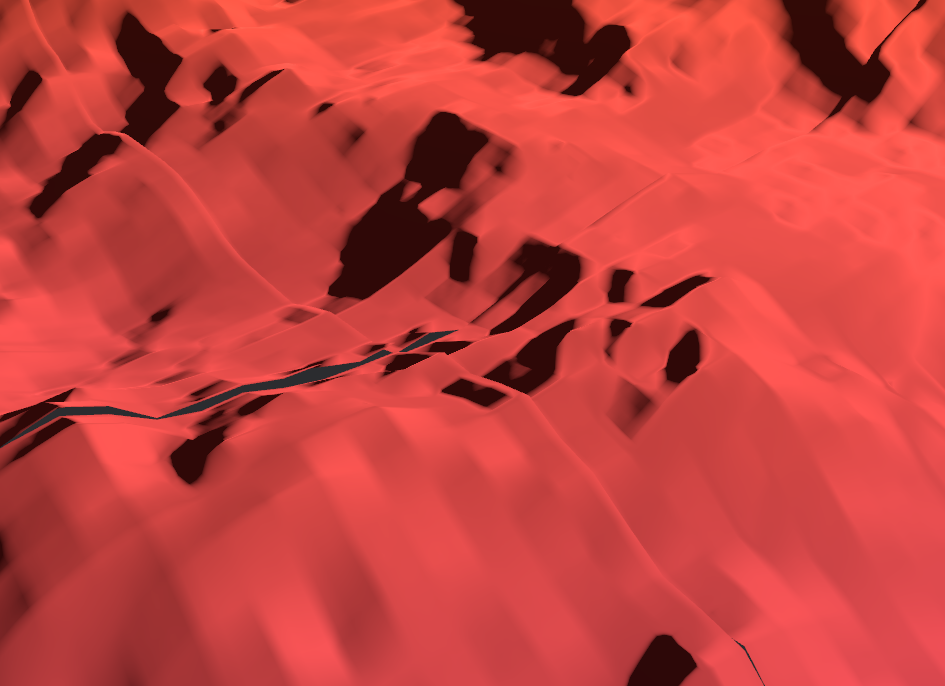

# Making bevy_terrain loading dynamic

For this, we need to know what happens, what is exposed to the user etc.. Following call chains doesn't work in Bevy's ECS system..

- `existing_tiles` is a problem, since we'd be theoretically unbounded or whatever... Completely filling with all coords for all possible tiles is a no-go....
  - `TileAtlas.new(TerrainConfig.attachments[AttachmentConfig])`
  - AttachmentConfig is a user-provided thing. Ideally, we'd add a trait to the crate where it becomes:
  ```rust
  /// Configures an attachment.
  #[derive(Encode, Decode, Clone, Debug)]
  pub struct AttachmentConfig<RW: TileReader + TileWriter> {
      /// The name of the attachment.
      pub name: String,
      pub texture_size: u32,
      /// The overlapping border size around the tile, used to prevent sampling artifacts.
      pub border_size: u32,
      pub mip_level_count: u32,
      /// The format of the attachment.
      pub format: AttachmentFormat,
      pub loader: RW,
  }
  ```
  - all these 
  - AtlasAttachment.save() - AtlasTileAttachmentWithData.start_saving/loading()
  
  - TileAtlas does the (un)loading from the file system
  Ramblings:
  - Maybe we want some on-disk caching or something, but that can be done in a TileReader implementation.
    - if we start changing the terrain, we can be saving diffs to disk rather than updated files.
    - Loading a specific area to disk y walking around in it or old-school pre-fetching a bbox based on history?

- what does `AtlasWithTileAttachmentWithData{data.generate_mipmaps(size, mips)}`  do? Aren't the mipmaps stored and loaded? -> from [here:](../../docs/implementation.md) they are used for trilinear filtering apparently...
- What does `../../config.tc do?`


## From image/tiff side

From image/tiff side, we need to use their multithreaded reader. basically:

```rust
// implement our own AsyncReader
pub struct RangeReader {

}

// impl AsyncRead for RangeReader {}
// impl AsyncSeek for RangeReader {}
// impl RangeReader for RangeReader {}
#[tokio::main]
fn main() - TiffResult<()>{
  let head_decoder = tiff::decoder::Decoder::new_async(RangeReader::new("https://epic_geotiff.com")).await?;
  // add some logic here to have one deoceder per overview
  let decoders = vec![tiff::decoder::ChunkDecoder::from_decoder(head_decoder)];
  for _ in 0..overviews {
    decoders.push(tiff::decoder::ChunkDecoder(head_decoder.next_image().await?))
  }
  // in all bevy stuff:
  fn read_tile(coord: TileCoordinate) {
    let chunk_index = coord.x*coord.y // put actual logic
    decoders[coord.lod].read_chunk(chunk_index) // not sure if should be this or decoders.len() - coord.lod
  }
  Ok(())
}
```

The problem now is how to have this `impl TileTrait` thing hold a shared object of `Vec<ChunkDecoder<R>>`... I think this should be a resource, or we need some weird initialization logic... Alternative is to just

```rust
// ...
let lod_head_decoder = tiff::decoder::Decoder::new_overview_async(RangeReader::new("url"), lod_level);
let lod_decoder = ChunkDecoder(lod_head_decoder);
// ...
```

omitting the need for a central vec, but this wholly depends on needs from `bev_terrain`...

## Geo stuff

Allowing to read _different_ geotiff (as height/albedo map) opens up quite the can of worms: height can be on a completely different CRS and/or [map grid](https://docs.ogc.org/is/19-008r4/19-008r4.html#_defining_model_coordinate_reference_systems) space than albedo. This could be solved by taking one grid as the reference (axis-aligned bla) and sample from the other. Also, in spherical space, tiles cannot be directly loaded from a COG, since they need to be re-sampled to fit into the cube.

```
/----
| tile loading <- retrieves tile(s) overlapping with game tile
\----
     |
/----
| warping/resampling <- this needs to know whether to a sphere or pancake
\----
     |
/----
| loading into shader
\----
```

blabla data duplication, storing a local copy of resampled tiles as wel as non-resampled tiles blabla source tiles can be deleted if already resampled around them.

```
+---------+   +------+
|interwebs|   |local |
+---------+---+------+
|source data->|cache |--\
+---------+---+------+  | resample
              |warped|<-/
              +---/--+
                 /
              Shader/TileAtlas
```

Now, the tiling scheme (S2) ?is? datum-indifferent, except it is not. I do not know whether an S2 tile index easily translates to lon/lat coordinates on an ellipsoid. I think S2 datum a unit sphere, and rust/geodesy _has_ this as a built-in ellipsoid, so we would `tile_index->tile_corner_coords->unit lat/long->ellipsoidal lat/lon-TileLoader->source coordinates->GeoTiffLoader.get_tiles(overlapping_tiles)`.

## Edge artifacts

Since cogs do not have any overlap at tile edges, the currently used technique of having edge overlap for preventing edge artifacts doesn't work without some thought. Either:
1. re-think the artifacts strategy
2. add moar preprocessing, requesting also tiles around the currently selected tile and adding edges manually. This is actually not the worst idea, since we're possibly adding resampling from multiple chunks anyways.
   - But first check how bad edge artifacts are with 0 overlap:
     


### ramblings

- Just came across [this answer about parallelization](https://stackoverflow.com/a/77281862/14681457), and [this blogpost on allocating CPU's](https://nitschinger.at/Binding-Threads-And-Processes-to-CPUs-in-Rust/)